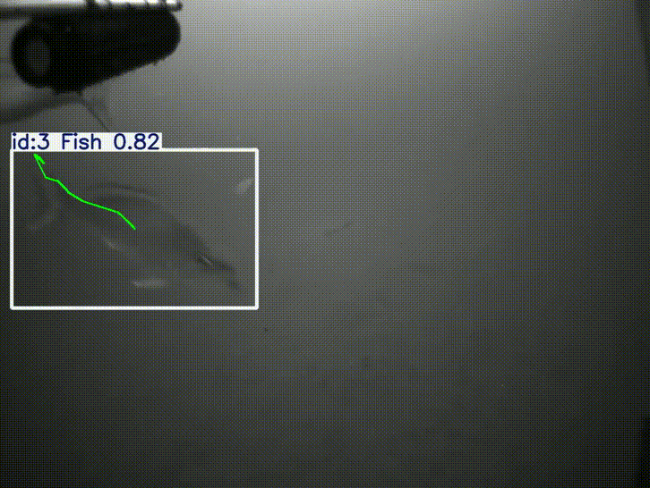
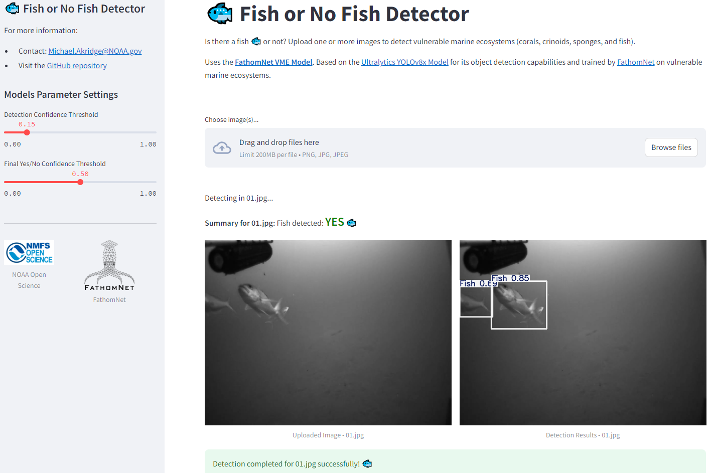
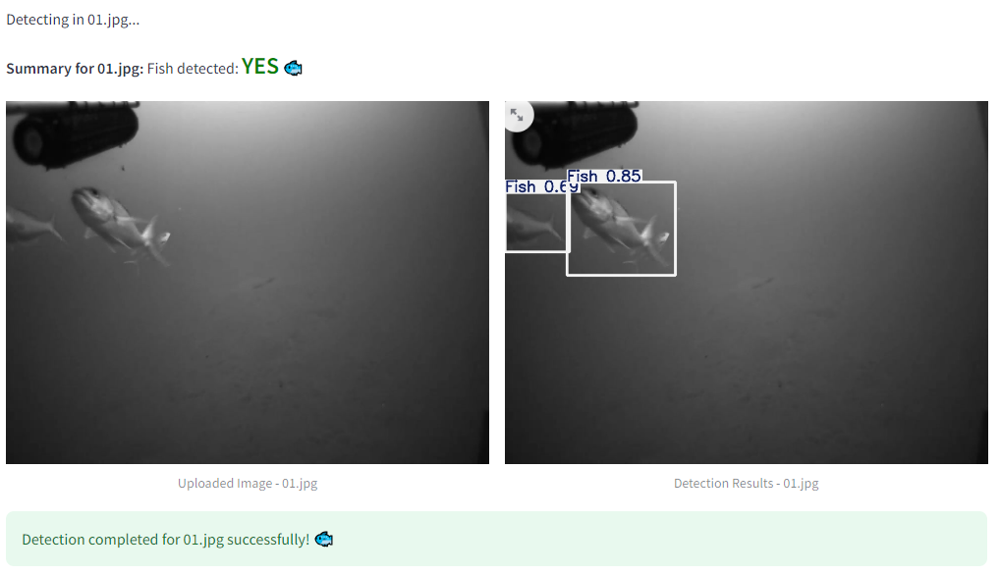
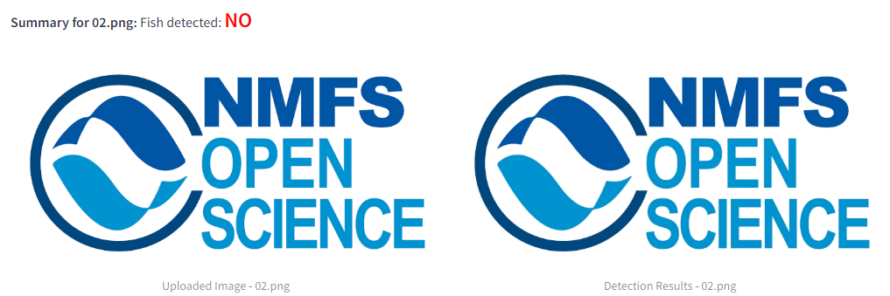
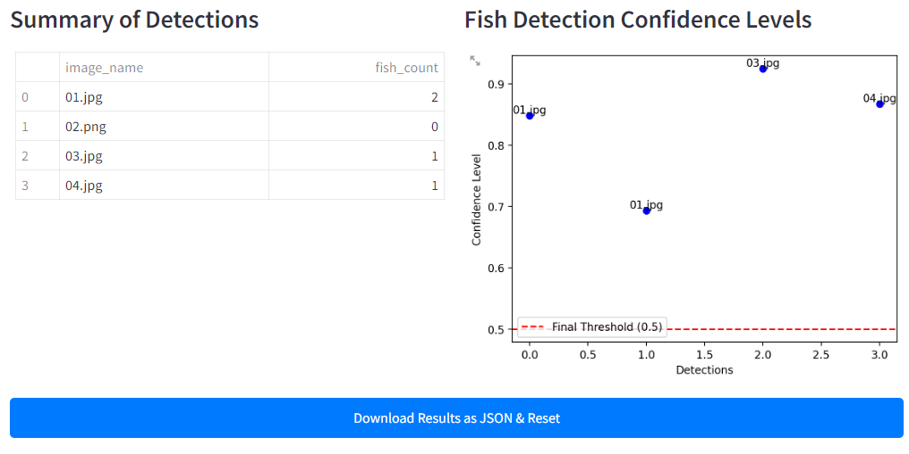
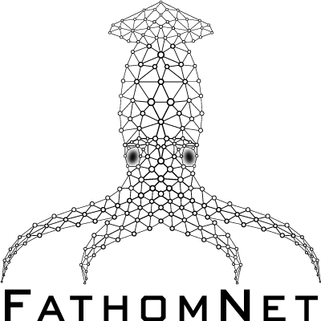

# Fish or No Fish Detector
Is there a fish 🐟 or not? 





## Features:
- Upload one or more images to detect Fish
- Adjust the confidence threshold for predictions & output
- Download all detection results, counts and bounding box results in JSON format

## Example of Fish Detection:


## Example of No Fish Detection:


## Example of Result Data:


## JSON Result Output
```
    {
        "image_name": "03.jpg",
        "bounding_boxes": [
            {
                "x1": 19.213233947753906,
                "y1": 83.37771606445312,
                "x2": 708.1510620117188,
                "y2": 422.69561767578125,
                "confidence": 0.9245972037315369,
                "class_id": 2,
                "class_label": "Fish"
            }
        ],
        "fish_count": 1,
        "confidences": [
            0.9245972037315369
        ]
    },
```
### Installation
1. Clone the repository:
    ```
    git clone https://github.com/MichaelAkridge-NOAA/Fish-or-No-Fish-Detector.git
    cd Fish-or-No-Fish-Detector
    ```
2. Install the required dependencies:
    ```
    pip install -r requirements.txt
    ```
3. Download one of the pre-trained models and save it in the `./models/` directory.
- [FathomNet VME Model](https://huggingface.co/FathomNet/vulnerable-marine-ecosystems/blob/main/best.pt)
- Small dataset model: https://huggingface.co/akridge/yolo8-fish-detector-grayscale
- Large dataset model: https://huggingface.co/akridge/yolo8-fish-detector-grayscale/tree/yolo8-fish-detector-grayscale-lgds

### Running the App

Run the Streamlit app with the following command:
```
streamlit run app.py
```
----------
# Fish or No Fish - Video

## Track & Plot Fish Over Time

#### Read More/How to:
- [Persistant Tracking](https://docs.ultralytics.com/modes/track/#persisting-tracks-loop)
- [Plot Tracks over time](https://docs.ultralytics.com/modes/track/#plotting-tracks-over-time)

## Model Links:
- Small dataset model: https://huggingface.co/akridge/yolo8-fish-detector-grayscale
- Large dataset model: https://huggingface.co/akridge/yolo8-fish-detector-grayscale/tree/yolo8-fish-detector-grayscale-lgds

## Model Details
Model trained to detect fish in underwater Grayscale Imagery using the YOLOv8n architecture for performance. The model leverages unsupervised learning techniques to learn patterns and identify fish without relying on fully labeled datasets.Uses the [FathomNet VME Model](https://huggingface.co/FathomNet/vulnerable-marine-ecosystems) for object detection in marine ecosystems, specifically focusing on corals, crinoids, sponges, and fish in its unsupervised learning method. It is built on top of the [Ultralytics YOLOv8x model](https://github.com/ultralytics/ultralytics/), providing fast and accurate object detection capabilities.
- View Git Branch Readme for more details:
    - https://github.com/MichaelAkridge-NOAA/Fish-or-No-Fish-Detector/tree/YOLOv8n-Fish-Detection-Model/models/yolov8n_fish_trained
----------
#### Disclaimer
This repository is a scientific product and is not official communication of the National Oceanic and Atmospheric Administration, or the United States Department of Commerce. All NOAA GitHub project content is provided on an ‘as is’ basis and the user assumes responsibility for its use. Any claims against the Department of Commerce or Department of Commerce bureaus stemming from the use of this GitHub project will be governed by all applicable Federal law. Any reference to specific commercial products, processes, or services by service mark, trademark, manufacturer, or otherwise, does not constitute or imply their endorsement, recommendation or favoring by the Department of Commerce. The Department of Commerce seal and logo, or the seal and logo of a DOC bureau, shall not be used in any manner to imply endorsement of any commercial product or activity by DOC or the United States Government.

##### License 
See the [LICENSE.md](./LICENSE.md) for details on this code.

##### Credit, Models & Licences
- For [FathomNet VME Model](https://huggingface.co/FathomNet/vulnerable-marine-ecosystems), see their [license](https://huggingface.co/datasets/choosealicense/licenses/blob/main/markdown/cc-by-4.0.md) for more details
- For Ultralytics YOLOv8x Model, see their [license](https://github.com/ultralytics/ultralytics/blob/main/LICENSE) for more details.  

<div align="center">
  
  
  
</div>
