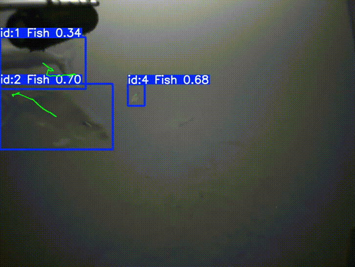
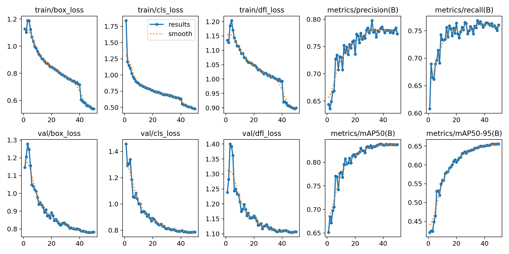
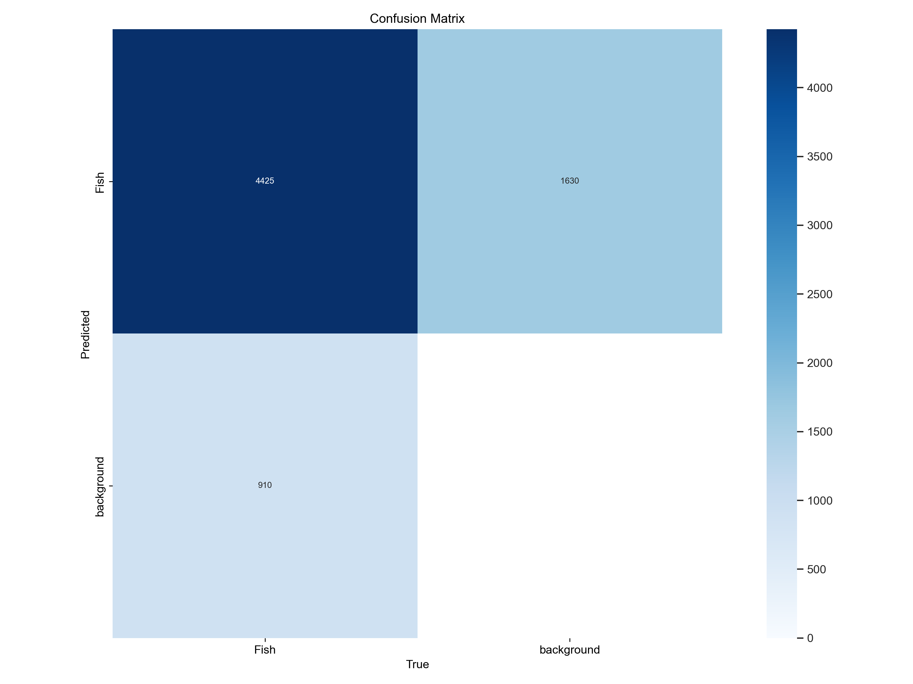
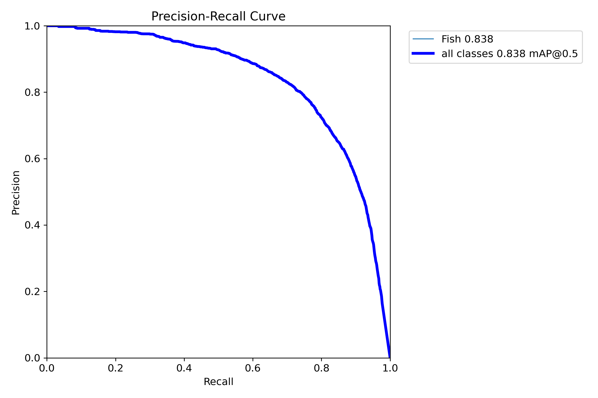
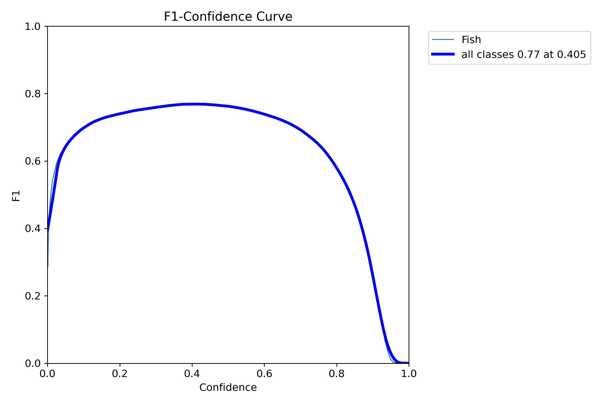

# Fish Detector | Large Dataset (23,411 images of MOUSS Data)- Grayscale  

## Model Details / Overview
This model was trained to detect fish in underwater **Grayscale Imagery** using the YOLOv8n architecture. The model leverages **unsupervised learning** techniques to learn patterns and identify fish without relying on fully labeled datasets.

- **Model Architecture**: YOLOv8n
- **Task**: Object Detection (Fish Detection)
- **Footage Type**: Grayscale(Black-and-White) Underwater Footage
- **Classes**: Fish

# Intended Use
- real time detections on Grayscale(Black-and-White) Underwater Footage
- Post-processed video/imagery on Grayscale(Black-and-White) Underwater Footage

## Test Results


# Factors
### Model Performance 
- Large Dataset: 23,411 MOUSS dataset images
- Unsupervised Learning: Flexible pattern recognition without fully annotated datasets, suited for grayscale imagery.
- Grayscale Imagery: Trained specifically on black-and-white underwater footage, enhancing performance in this environment.
- Model Architecture (YOLOv8n): lightweight and optimized for real-time fish detection in underwater footage.
- Training Data: Quality and diversity of the grayscale underwater dataset, split into 80% training and 20% validation.
- Training Parameters: Configured with 50 epochs, a 0.001 learning rate, and 416x416 image size for optimal model convergence.

## Model Weights
The model's weights can be found [here](./yolov8n_fish_trained_lgds.pt)

## Metrics
Below are the key metrics from the model evaluation on the validation set:

- **Precision**: 0.863
- **Recall**: 0.869
- **mAP50**: 0.936
- **mAP50-95**: 0.856

## Training Validation Results
### Training and Validation Losses


### Confusion Matrix


### Precision-Recall Curve


### F1 Score Curve


## Training Configuration
- **Model Weights File**: `yolov8n_fish_trained_lgds.pt`
- **Number of Epochs**: 50
- **Learning Rate**: 0.001
- **Batch Size**: 16
- **Image Size**: 416x416
- 
## Training and Evaluation Data
- **Dataset**: 23,411 MOUSS dataset images from one location(drop) consisting of Grayscale(black-and-white) underwater footage.
- **Training/Validation Split**: The dataset was split into 80% training and 20% validation.
- **Classes**: The model was trained on a single class (fish).
- **Learning Approach**: Unsupervised learning, meaning the model identified patterns in the data without needing detailed annotations for all images.

## Download Training Data (Requires Google SDK GSUTIL tool)
```
gsutil -m rsync -r gs://nmfs_odp_pifsc/PIFSC/SOD/MOUSS/jpg/20161014_192048_1 U:\temp\20161014_192048_1
```

## Deployment
### How to Use the Model

To use the trained model, follow these steps:

1. **Load the Model**:
   ```python
   from ultralytics import YOLO

   # Load the model
   model = YOLO("yolov8n_fish_trained_lgds.pt")

### Limitations
The model was trained on black-and-white underwater footage, and may not generalize well to color images or videos with different lighting conditions.
The unsupervised learning nature of this model may lead to some incorrect detections, particularly in noisy environments where it may confuse other underwater objects for fish.
Images with complex backgrounds, occlusions, or poor resolution may affect the model's performance.

### Additional Notes:
- **Grayscale Imagery**: The model may perform better on grayscale images and might not generalize well to color underwater footage or images with different lighting conditions.
- **Unsupervised Learning**: Since using an unsupervised approach, it's worth noting that this can make the model more flexible but also more prone to errors or misclassifications without annotated data.
- **Ethical Considerations** The unsupervised learning approach could lead to biases in detections, especially in new environments or types of marine life that were not represented in the training dataset. This model should not be used in critical applications without thorough validation to ensure it doesn't miss key detections or produce incorrect results in sensitive scenarios. Consider the potential environmental or societal impact when using the model for marine conservation or research, and ensure that the detections are verified.
